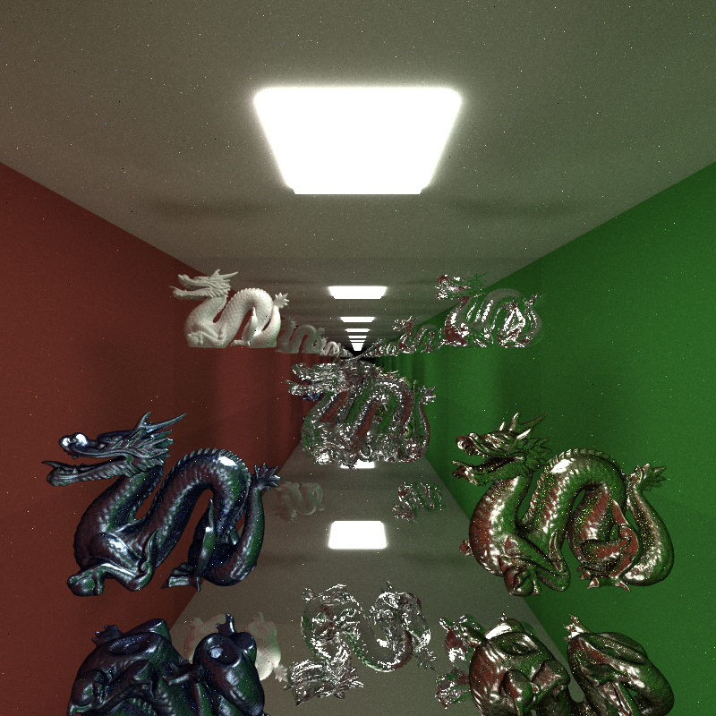
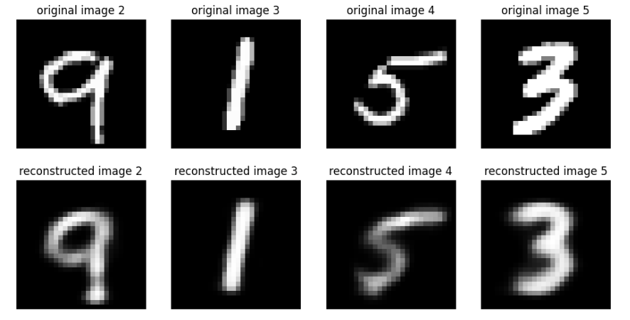
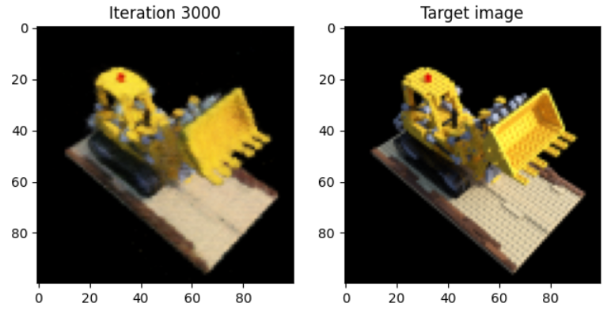
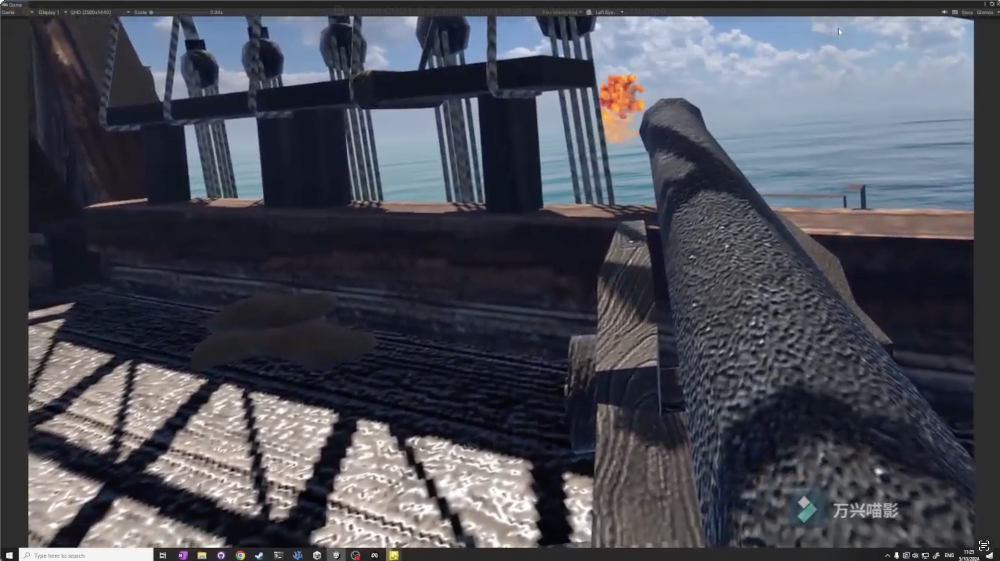
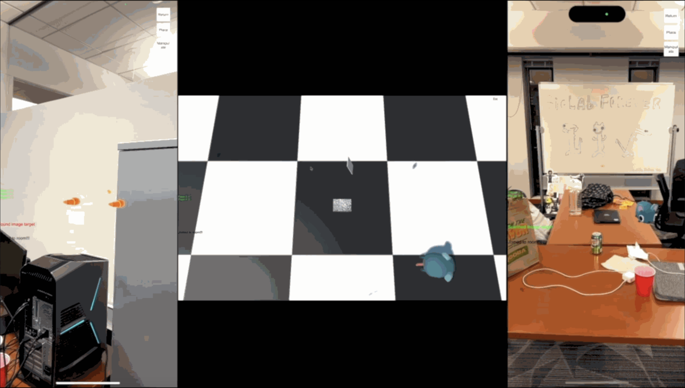

  

    
  

  

    <h3><a href="https://github.com/JackeyTY/CUDA-Path-Tracer" target="_blank">CUDA Path Tracer</a></h3>
    
High-performance CUDA Path Tracer utilizing material sorting and termination compaction to improve kernel efficiency. Features supported:

    <ul>
  		<li>Stackless BVH GPU traversal, tinyObj meshing loading</li>
      <li>Direct lighting with NEE and MIS, Russian roulette path termination</li>
  		<li>Physically-based depth of field, Stochastic antialiasing</li>
      <li>BSDF evaluation on diffuse, perfect specular, glass, and glossy materials</li>
		</ul>
  

  

    
  

  

    <h3><a href="https://github.com/JackeyTY/CUDA-Flocking" target="_blank">Flocking Simulation</a></h3>
    
Flocking simulation based on the <a href="https://vergenet.net/~conrad/boids/pseudocode.html" target="_blank">Reynolds Boids algorithm</a> in CUDA. Optimized performace with coherent uniform grid-based search for updating positions and velocities.

  

  

    
  

  

    <h3><a href="https://github.com/JackeyTY/Notebooks/tree/main/VAE" target="_blank">MNIST Digits Reconstruction</a></h3>
    
MNIST Digits reconstruction using VAE and PPCA.

  

  

    
  

  

    <h3><a href="https://github.com/JackeyTY/Notebooks/tree/main/NeRF" target="_blank">Synthetic 3D Scene Rendering</a></h3>
    
Synthetic 3D scene rendering from 2D LEGO images using NeRF with volumetric rendering.

  

  

    
  

  

    <h3><a href="https://github.com/JackeyTY/MiniMinecraft" target="_blank">Mini-Minecraft</a></h3>
    
Mini-minecraft game built with C++ in Qt. Features supported:

    <ul>
  		<li>Procedural terrain and cave system generation with noise functions</li>
      <li>Real-time shadow mapping</li>
  		<li>Day and night cycle, post-process shaders</li>
		</ul>
  

  

    
  

  

    <h3><a href="https://drive.google.com/file/d/1SU6jbi5u6izvB80GoFA6V1Pj6tF0B1Cf/view?usp=sharing" target="_blank">Cannon Clash</a></h3>
    
Caribbean-style VR game on Quest 3, allowing players to catch and shoot cannonballs using intuitive handle controls.

    
Built in Unity.

  

  

    
  

  

    <h3><a href="https://drive.google.com/file/d/1sjUQvk-CE76R3g1mi8g49GDBiEKZrdt3/view?usp=sharing" target="_blank">Undead Road</a></h3>
    
Post-apocalyptic style, third-person action survival game. The player navigates a heavily armed truck towards the destination while shooting and smashing every zombie that gets in the way.

    
Built in UE 5.

  

  

    
  

  

    <h3><a href="https://github.com/JackeyTY/ARBall" target="_blank">Yo Mice!</a></h3>
    
Multiplayer AR game on iOS using AR Foundation Framework and Photon Engine for cross-platform networking.

    
Built in Unity.

  

  

    
  

  

    <h3><a href="https://github.com/JackeyTY/Space" target="_blank">Space</a></h3>
    
A cosmetic-themed endless runner game, inspired by Space Invaders, with an airdrop system and adaptive difficulty system on iOS.

    
Built in Unity.

  

  

    
  

  

    <h3><a href="https://github.com/JackeyTY/OpenGL-Fun" target="_blank">OpenGL Fun</a></h3>
    
Set up OpenGL pipeline and play with shaders!

    <ul>
  		<li>Vertex shaders deformations</li>
      <li>Fragment shaders post-process effects</li>
		</ul>
  

  

    
  

  

    <h3><a href="https://github.com/JackeyTY/ParticleSystem" target="_blank">Fireworks Simulation</a></h3>
    
Simple Fireworks particle system simulation in C++.

  

